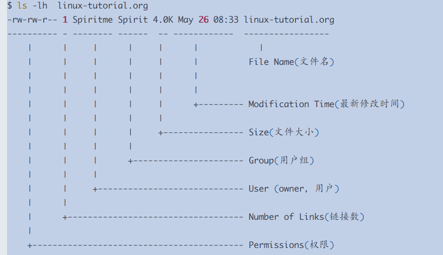
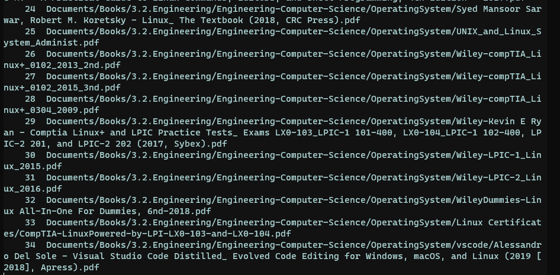
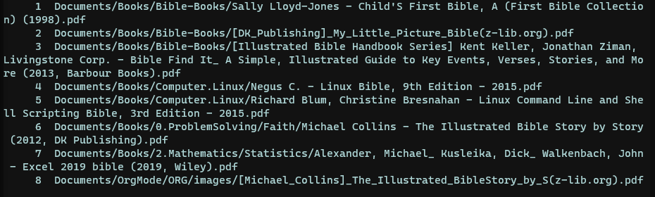

# 帮你精通Linux：Find命令的八大属性

我们有时候找东西，翻箱又倒柜；穷举法，二分法，般般武艺都用上了，一天时间也赔上了，但是东西就是找不着。内心之焦急，大脑中无数次地升起念头，想要给那件东西打个电话，听个铃声。

幸运的是，找不着东西，永远都不会发生在Linux系统中，因为有 Find 命令。

我们在上文中，[帮你精通Linux：一切皆为文件的7大属性](https://www.toutiao.com/i6901232469132198412/?group_id=6901232469132198412)，从“一切皆为文件”出发，探讨分析了文件的七大属性。



文件的七列属性

从右往左依次为1)文件名 2)最新修改时间 3)文件大小 4)用户组 5)用户 6)连接数 7)权限

当我们在头脑中构建了这样七列的模型之后，就能以此为基础构筑我们的 #Linux# 知识结构大厦。由此，不妨先小试牛刀，用这七列结构的框架，一一拆解分析Linux命令中选项最为复杂的 find 工具。

# 第一列：文件名查找

文件名放在第一列，似乎是天经地义，因为一想到文件，首先窜入我们头脑中的问题是'文件名是什么？’。头把交椅的位置当仁不让。一谈到文件，或者一位朋友，首先想到的是名字，他姓甚名谁。

举例查看Home目录中所有的Linux相关的pdf格式的书籍：

```
$ find ~ -iname "*linux*.pdf" | nl
```




显示的结果一目了然——有34本书。Find 命令帮助我们始终对全局有高颗粒度的把握。选项 '-iname’ 中 'i' 为case-insensitive（不区分大小写），通常我们都需要忽略大小写。

当然，除了应用 wildcards（通配符）之外，也可以使用regex（正则表达式），比如搜索家目录下所有包含’bible'这个单词的pdf文件。

```
$ find ~ -type f -iregex '.*bible.*pdf$' |nl
```




如图所示，此处’-iregex'，我们同样使用了 i (case-insensitive)。除了regex选项，上面的例子还使用了 '-type' 选项，指定文件类型为 f  (file)，如此操作的目的主要是为了节省搜索时间。倘若完全倚靠regex匹配，往往需要较长时间。

我们停下来回想一下，文件类型在七列属性的什么位置呢？

在最左边的第七列中10个字符 '-rw-rw-r--' 里面的第一个字符'-'，也就是说，我们用到了七列属性中的两列来筛选我们的目标文件，在后文中，我们再展开阐述对第七列的查询。

闭上眼睛想一下他们的位置，使这个过程在头脑中完全可视化。当日后涉及三个四个，七个八个选项的时候，也能够在思考过程凌而不乱，有章有法。

# 第二列：按时间搜索

时间戳放在第二位似乎也符合我们的本能，知道名字之后马上就想要了解其年龄。我们复习下第一课中探讨的文件的三个时间属性。

1) 最新修改时间 (modification-time, mtime)

2) 创建时间 (creation-time, ctime)

3) 访问时间（或上次打开的时间）(access-time, atime)

暂停片刻，脑中过一遍这七列属性，想想第一列和第二列的位置，可以简单地具象成一排插座的七个开关。

**2.1 粗颗粒度的时间查询**

按时间戳搜索，给我们日常的工作提供了极大的便利。比如到了下班时间，我要复盘当天的工作量，回想当日的主要工作，翻译成 find 命令语句，就是在这一天里，我都在哪些 文件上工作过？（哪些文件被我修改过？）

```
$ find ~ -type f -iname "*.org" -mtime -1

/home/gaowei/linux-tutorial.org
```

结果显示，我过去的24个小时只在一个'org’文件上工作过。 '-mtime 1’ 中的数字 1 是 1*24 小时，时间限定在24小时之内；如果在数字 1 前面添加 '+' 即'-mtime +1' ，它的表意很容易猜到，就是24小时之外的所有文件。

```
$ find ~ -type f -iname '*.org' ! -path "*emacs.d*" -mtime +1  |nl
```

返回的结果有1871项，同时我们在上面的例子中引入了逻辑符号'！’(not)，从结果排除路径中包含关键词'emacs.d'的所有文件。

**2.2 细颗粒度的时间查询**

上述以24小时为间隔的查询，颗粒度过大；我们可以以分钟为单位提高查询精度。比如查询过去的8个小时（也就是480分内），我在哪些文件上工作过。

```
$ find ~ -type f -iname "*.org" -mmin -480
```

从例子中可以看到，此处的480分钟并不太直观，需要稍加思考才恍然大悟原来是过去的8个小时，我们将其修改成一目了然的模式。

```
$ find ~ -type f -iname "*.org" -mmin -$((60*8))
```


60*8 比 480 直观多了，此处的逻辑是学一点儿 bash-script 还是有用的。

按照粗颗粒度mtime的思路，修改 '-480'为 '+480'，就是查询8个小时之外的修改过文件。

需要警惕的一点，如果限定的搜索时间写成没有前缀的形式如 '480'，它表示的是在8个小时以前这个特定时间点上，通常这并非我们的本意。这一点区别于 '-480' 是8个小时之内，'+480' 是8个小时之外。


2.3 **使用相对时间查询**

相对时间查询是颗粒度更高，更加精准的查询方式。命令虽简单，意义却重大。

```
$ find . -newer a-file
$ find . -older a-file
```

当我们按部就班一个文件一个文件地创建项目，或者网络上下载很多资料，如果能迅速锁定某个文件之后的所有资料，可以有效的提高查询效率。比如，我在边看视频，边截图，边做笔记。当一个视频看完，我要汇总在看这个视频的过程中，或是从视频中直接截取的、或是从网络中下载的、或者通过其他渠道，往电脑里添加的所有图片。

这个时候，如果上述的两种方法筛选，很难一次就完成任务（需要一步查询和一步在筛选的工作）。有了相对时间，瞬间拨云见日，而实现的方法则简单极了：

```
find . -name '*.png' -newer this-image.png
```

此处的 'newer' 默认就是比较 'modification-time'，若要比较其他两个时间属性则要显式指出如'cnewer'和’anewer'。

**2.4 按照创建时间与访问时间搜索**

以上我们针对 modification-time，分别介绍了粗颗粒度的mtime，细颗粒度的mmin，以及更加灵活的相对时间查询 (newer and  older)。以上三项同样适用于创建时间 (creation-time) 与访问时间 (access-time)。

不过此处对创建时间（creation-time），多说几句。当我们调用 chmod  命令修改某文件的权限之后，该文件的创建时间也会就此更新。因此，创建时间(creation-time)的官方名称是更改时间（changed-time）。但是，更改时间这个名称含糊不清，尤其使初学者困惑。

# 第三列：按文件大小查找

上文第二列中，我们详述了文件时间戳的三个属性。在继续探讨第三列‘文件的大小’之前，我们再次暂停，整体回想一下这七列，这一排插座上的七个开关。我们希望达到这样一个目的，就是从大脑之眼中能始终看到这七列，虽然当下具体处理的是局部的一列，但是在大脑的具象中一直展示为整体的七列。

前面两列，我们知道了文件的名字，知道了她的年龄，下一步自然要了解其身高体重。

以下是文档中列出的文件大小的6个单位：

```
    `b'    for 512-byte blocks (this is the default if no suffix is used)
    `c'    for bytes
    `w'    for two-byte words
    `k'    for kibibytes (KiB, units of 1024 bytes)
    `M'    for mebibytes (MiB, units of 1024 * 1024 = 1048576 bytes)
    `G'    for gibibytes (GiB, units of 1024 * 1024 * 1024 = 1073741824 bytes)
```

值得一提的是，我们可以对'-size’使用组合查询，比如查询Home目录下所有大于500k而小于100M的文件。

```
find ~ -size +500k -size -100M
```

以上三列是文件最核心的三个属性：文件名，时间戳，文件大小。

# 第四列与第五列：按照组或者所有者查找

我们不妨再次回顾七列的结构图：


文件的七列属性

第四列为用户组，第五列为用户（本机所有者）

比如查找'/etc'目录下，所有用户组为'shadow’的文件：

```
$ sudo find /etc -group shadow -ls
```

或者查找非root用户的文件

```
$ sudo find /var/spool -not -user root -ls 
```

我们还可以使用‘-nouser’ 和‘nogroup’发现一些’另类'，即查到不属于当前任何用户或者用户组的文件。

# 第六列：通过 inode 查询

第六列为链接数量。但是单单倚靠着这一点，我们查询不到有价值的信息。链接的本质是 inode，因此 Find 提供了通过 inode 查询的方法。

查看当前文件的 inode，使用 -i 选项:

```
➜  Public ls -il
total 0
3659174697526837 drwxr-xr-x 1 gaowei gaowei 512 Aug 31 07:57 01.SICP-in-Elisp3377699720904324 drwxr-xr-x 1 gaowei gaowei 512 Aug 31 07:57 02.Build-Things-with-Elisp
2251799814061898 drwxr-xr-x 1 gaowei gaowei 512 Aug 31 07:57 02.Master-Emacs-Lisp-with-Solid-Procedures
4503599627621609 drwxr-xr-x 1 gaowei gaowei 512 Aug 31 07:56 03.sharpen-python-with-leetcode-problems
7599824371565574 drwxr-xr-x 1 gaowei gaowei 512 Aug 31 07:57 05.Reading-Plan
7881299347988414 drwxr-xr-x 1 gaowei gaowei 512 Aug 30 11:09 Centuar-Emacs
3659174697324767 drwxr-xr-x 1 gaowei gaowei 512 Sep  1 13:28 ChezScheme
9570149208252666 drwxr-xr-x 1 gaowei gaowei 512 Sep  1 11:25 ChezSchemeBackup4785074604369108 drwxr-xr-x 1 gaowei gaowei 512 Nov 23 15:47 Master-Emacs-From-Scrach-with-Solid-Procedures
4785074604392710 drwxr-xr-x 1 gaowei gaowei 512 Dec  6 13:59 Master-JavaScript-Instantly
2533274790612682 drwxr-xr-x 1 gaowei gaowei 512 Sep  1 16:14 Shell-Courses
```

其中第一列为 inode number。

从上例可知，这两个文件相同只是名字不同。尝试用 Find 查询：

```
find . -inum 3659174697526837 -ls
```

# 第七列：按照权限查找

第七列中有10个字符 -rw-rw-r--，一个文件类型 + 三组用户权限。文件类型与权限是亲密伙伴，常常使用组合查询。举例查询Home目录下，所有权限为777 的文件。

```
$ find ~ -type f -perm 777 |tail -n 5
```

**7.1 文件类型**

当查询多种文件类型的时候，可以使用组合的方式，他们之间以 , 分割。比如查询下面的四种文件格式：

```
$ find ~ -type c,b,f,l  -perm 777 我们可以清晰的看到权限 `777` 的文件也被查询到。
```

**7.2 权限查询**

例子中 -perm 777 是严格匹配查询，如果查询所有权限大于等于 666 的文件，则需要前缀 -。

```
find ~ -type f -perm -666 
```

则能看到权限 777 的文件也被查询到。

# 第八属性：控制查找的深度

与一周只有七天不同，此处我们还有一个‘星期八’，第八个属性。

某些目录，多层深度极高，直接查找往往占用大量的CPU计算量，比如 根 目录：

```
$ tree -L 3 -d | head -n 20
➜  / tree -L 3 -d | head -n 20
.
├── bin -> usr/bin
├── boot
├── dev
│   ├── block
│   ├── bsg
│   ├── fd -> /proc/self/fd
│   ├── mapper
│   ├── net
│   ├── pts
│   ├── shm -> /run/shm
│   └── vfio
├── etc
│   ├── ImageMagick-6
│   ├── NetworkManager
│   │   ├── conf.d
│   │   ├── dispatcher.d
│   │   ├── dnsmasq-shared.d
│   │   ├── dnsmasq.d
│   │   └── system-connections
```

此时可以用 -mindepth 和 -maxdepth 选项指定深度。

```
$ find ~ -maxdepth 2 -iname '*doc*'
```

# 小结

我们从第一列文件名出发，又分别阐述了按照 2）时间戳 3）文件大小 4）用户组 5）用户 6）inode 7）文件权限 以及额外的第八属性目录深度，进行查找的方法
