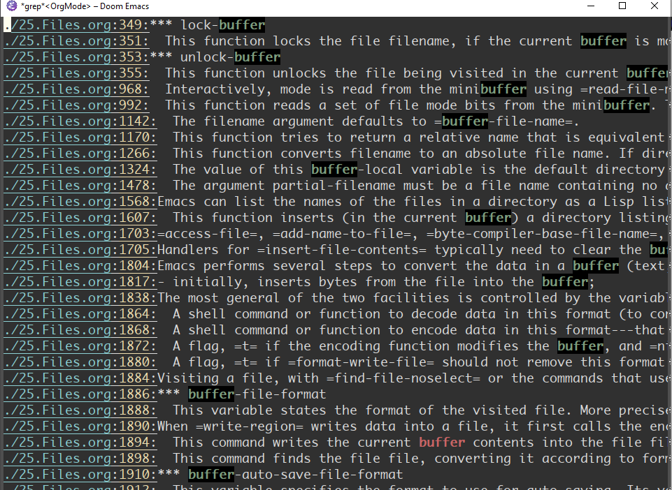

# High-level Actions of Find Command

We will continue to explore find's advanced query functions, which will be divided into four aspects :

1. Predefined-Actions
2. User-defined Actions
3. Cooperate with grep
4. Operator logic operation

```
|----------+-----------------+----------------------------------------|
|     Item | Name            | Methods                                |
|----------+-----------------+----------------------------------------|
|  Actions | predefinded     | -delete, -ls, -print, -print0          |
|----------+-----------------+----------------------------------------|
|  Actions | Custom          | -exec, -ok, xargs                      |
|----------+-----------------+----------------------------------------|
|  Actions | Synergy         | work with grep                         |
|----------+-----------------+----------------------------------------|
| Operator | logic operatons | -and, -or, -not                        |
|----------+-----------------+----------------------------------------|
```

# 1.Predefined Actions

Searching is the first step, and the second step is to process the search results. For example, delete all search results.

In the Documents directory, search for empty documents, and then delete them.

```
$ find ~/Documents -maxdepth 3 -empty -type f |nl
```

The delete operation needs to be processed in the second step, we use the loop structure and read command

```
find ~/Documents -maxdepth 3 -empty -type f | while read line; do rm $line; done
```

To avoid writing `while read line; do rm $line; done` each time, the Find command provides many pre-defined behaviors. Take the above example of deleting search results, just add -delete after it

```
find ~/Documents -maxdepth 3 -empty -type f -delete
```

We have already touched on the predefined behavior of -ls

```
find ~/Documents -maxdepth 3 -empty -type f -ls
```

Other predefined actions include:

1. `-print` Print the current result to the standard output (Terminal)
2. `-print0` means that newline characters such as spaces in the file name are  represented by empty values, which are used in conjunction with the -0  of xargs.
3. -quit Quit the query after matching a result.

# 2. User-defined Actions

The above predefined actions are very convenient, but their disadvantages of poor flexibility are also significant. For example, the `-ls` in the above example has only one display format.

**-exec (execute) custom execution**

When more flexible and diverse display formats are needed, `-exec` (execute) needs to be introduced

```
find ~/Documents -maxdepth 3 -empty -type f -exec ls -lh '{}' ';'
```

`{}`refers to all the previous search results, which can be understood as  the previous query results are put into the {} basket, and the subsequent `;`  is the command separator.

**ok instead of exec**

The alternative option of `exec` is `-ok`, which will prompt the user to confirm before each execution. When processing delete tasks, -ok is a safer option.

```
find ~/Documents -maxdepth 3 -empty -type f -ok rm '{}' ';'
```

**+ Terminator**

In addition to the terminator with; as the command, there is also a + terminator.

```
find ~/Documents -maxdepth 3 -empty -type f -ok ls -lh '{}' +
```

The difference between the two is that when ending with `;` the actual execution process of the program is:

```
ls -lh file1
ls -lh file2
ls -lh file3
...
```

That is, execute the `ls` command operation for each search result one by one, which is usually not efficient. And ending with `+` will perform an ls operation on the search result.

```
ls -lh file1 file2 file3 ...
```

At the same time, there is a solution that combines with xargs. This method is not recommended, so I should mention it.

```
find ~/Documents -maxdepth 3 -empty -type f | xargs -lh
# equivalent to 
find ~/Documents -maxdepth 3 -empty -type f -ok ls -lh '{}' +
```

# 3. Work with the grep command 

To search for all files containing the  keyword "buffer" in the Emacs directory, and execute the following  command:

```
find . -type f -exec grep --color -nH --null -e "buffer" \{\} +
```

The result is:



# 4. logical operation

The options of the three logical operations in the Find command are ``-and(a), -or(o), -not`

For example, in the last lecture, we mentioned querying various types of file formats

```
find ~ -type f,d,l
```

Use `or` logic to rewrite it as:

```
find ~ \( -type f -or -type d -or -type l \)
```

`-not` case

```
find ~ \( -type f -not -perms 0600\) -or \( -type d -not -perms 0700 \)
```

`-and` logic is the default execution action.

The basic expression of using logical relations is:

```
expr1 -operator expr2
```


# 5. Summary


Based on the seven attributes of the file, we have successively  discussed the eight basic query functions of Find and four high-level  applications, which are summarized as follows:

```
|----------+-----------------+----------------------------------------|
|     Item | Name            | Methods                                |
|----------+-----------------+----------------------------------------|
|        1 | filename        | -iname, -ipath, -regex                 |
|----------+-----------------+----------------------------------------|
|        2 | timestamp       | -mtime(atime,ctime); -mmin(amin, cmin) |
|----------+-----------------+----------------------------------------|
|        3 | size            | -size(b,c,k,M,G)                       |
|----------+-----------------+----------------------------------------|
|        4 | group           | -group                                 |
|----------+-----------------+----------------------------------------|
|        5 | user            | -user                                  |
|----------+-----------------+----------------------------------------|
|        6 | inode           | -inum                                  |
|----------+-----------------+----------------------------------------|
|        7 | permission      | -type, -perm                           |
|----------+-----------------+----------------------------------------|
|        8 | depth           | -mindepth，-maxdepth                   |
|----------+-----------------+----------------------------------------|
|  Actions | predefinded     | -delete, -ls, -print, -print0          |
|----------+-----------------+----------------------------------------|
|  Actions | Costom          | -exec, -ok, xargs                      |
|----------+-----------------+----------------------------------------|
|  Actions | Synergy         | work with grep                         |
|----------+-----------------+----------------------------------------|
| Operator | logic operatons | -and, -or, -not                        |
|----------+-----------------+----------------------------------------|

```
The above is all the contents of Find query.
